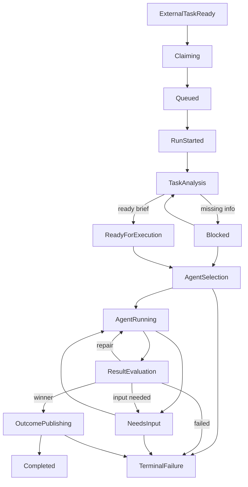

# gg -- Agent Orchestrator

`gg` is a local orchestrator that turns backlog work into a durable execution pipeline:

- picks an issue from GitHub or GitLab,
- claims it,
- analyzes the task against repo context,
- fans out candidates in isolated worktrees,
- verifies them with tests and other checks,
- evaluates the results,
- publishes the outcome as a comment and optional PR,
- moves PR-backed work into review instead of marking it done immediately,
- persists the whole run under `.gg/runs/<run_id>/`.

The current implementation is centered around a durable state machine, resumable artifacts, sandbox-aware execution, and operator recovery commands.

**How It Works**

1. `gg init` creates `.gg/params.yaml`, operational `.gitignore` entries, and repo-local runtime defaults.
2. `gg issue <n>` or `gg run` creates a run record, claims the task, and writes state transitions into `.gg/runs/<run_id>/state.json`.
3. Task analysis builds a `task-brief` from the issue, comments, local inputs, and repo context from the knowledge engine.
4. The orchestrator allocates candidate worktrees, runs agents, captures patches and artifacts, and executes verification commands.
5. Deterministic evaluation selects a winner or requests repair / input.
6. Publishing applies the winning patch in an integration worktree, optionally pushes a branch, creates or reuses a PR, posts result comments, and:
   for `--no-pr` marks the issue done, for PR mode swaps `work_label` to `in_review_label`.
7. Selection can also filter by project-board status and will fetch board-listed issues that were missed by the initial `list_issues` limit.
8. `gg resume`, `gg retry`, `gg provide`, `gg cancel`, `gg clean`, and `gg status` operate entirely from durable state.

**State Graph**



**Runtime Model**

- **Durable state**: each run has `state.json`, `pipeline.jsonl`, `errors.jsonl`, `cost.jsonl`, versioned task briefs, context snapshots, candidate artifacts, evaluation artifacts, and run summaries.
- **Worktree isolation**: every candidate runs in its own git worktree under `.gg-worktrees/`.
- **Sandbox-aware execution**: Codex execution can run through `sandbox-runtime`; preflight artifacts record whether the sandbox is required and available.
- **Verification-first evaluation**: candidates are scored only after verification results, policy checks, mutation checks, and baseline comparison.
- **Idempotent publish flow**: publishing stays in `OutcomePublishing` until all side effects are complete.
- **Tracker semantics**: PR-backed runs move issues into `in review`; local / no-PR runs mark them done directly.
- **Recovery**: interrupted runs can be resumed from durable state; blocked and needs-input runs can be reactivated with issue comments or `gg provide`.

**Key Commands**

```bash
gg init
gg doctor --json
gg issue 42
gg issue 42 --dry-run
gg issue 42 --no-pr
gg run
gg run --debug
gg resume <run-id>
gg retry <run-id>
gg provide <run-id> --message "Use Spanish"
gg cancel <run-id> --abandon-worktrees
gg clean --dry-run
gg status --json
```

**Configuration**

Main runtime policy lives in `.gg/params.yaml`.

Important sections:

- `task_system`: platform selection, labels, claim / in-review / done semantics.
- `selection`: include / exclude labels plus optional `board_status`.
- `runtime`: candidate fanout, timeouts, sandbox/runtime settings, network policy, disk policy, port range.
- `verify`: setup/test/lint/typecheck/security/custom commands, baseline policy, advisory vs required checks.
- `analysis`: issue/comment/context limits and context budget policy.
- `audit`: event hashing, artifact hashing, external audit sink.
- `cost`: optional budgets for exact token / USD metrics.
- `cleanup`: `blocked_timeout_days`, `keep_last`, `ttl_days`.
- `agent`: Codex command and backend retry / breaker settings.

**Artifacts**

Typical run layout:

```text
.gg/
  params.yaml
  runs/<run_id>/
    state.json
    pipeline.jsonl
    errors.jsonl
    cost.jsonl
    artifacts/
      task-brief-vN.json
      raw-issue-vN.json
      context-snapshot-vN.json
      candidate-selection.json
      evaluation.json
      run-outcome.json
      run-summary.json
    candidates/<candidate_id>/
      agent-handoff.json
      agent-result.json
      candidate-result.json
      patch.diff
      verification.json
```

**Execution Semantics**

- Dry-run uses a shadow store and does not create durable run artifacts in the repo.
- Dirty non-`.gg` workspaces are blocked unless an explicit base is provided.
- Context budgets are enforced after task analysis.
- Cleanup respects terminal retention policy and reports reclaimable bytes.
- Cost budgets activate only when exact `token_usage` or `total_usd` metrics are present.
- Artifact checksums validate persisted sanitized bytes when `audit.hash_artifacts: true`.
- Board-based selection can supplement the initial issue list with older board-listed issues missing from the first fetch window.

**Testing**

Run the current suite with:

```bash
uv run --extra dev pytest -q
```

If sandbox integration is needed on Python 3.11+, install the optional extra:

```bash
uv sync --extra sandbox --extra dev
```
