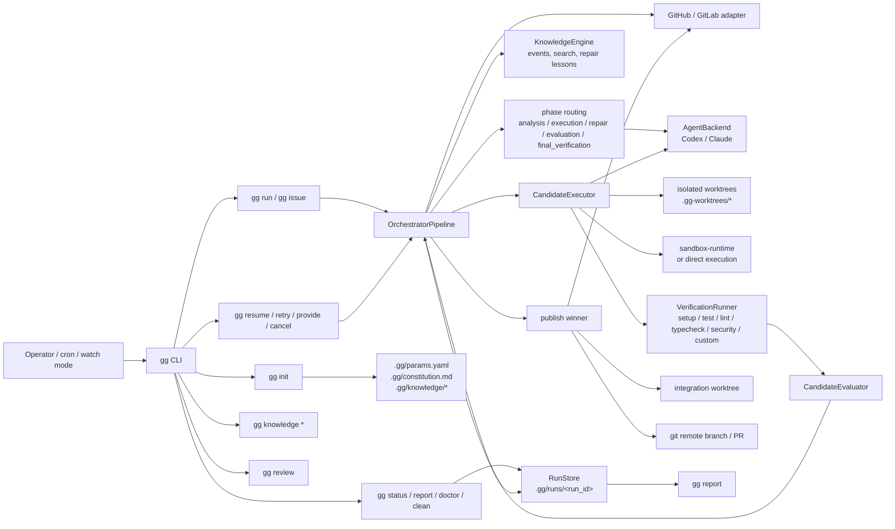
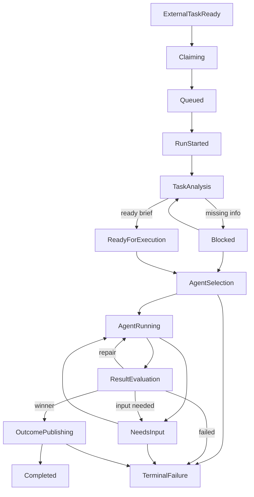

# gg -- Agent Orchestrator

`gg` is a local orchestrator that turns backlog work into a durable execution pipeline:

- picks an issue from GitHub or GitLab,
- claims it,
- analyzes the task against repo context,
- fans out candidates in isolated worktrees,
- verifies them with tests and other checks,
- evaluates the results,
- publishes the outcome as a comment and optional PR,
- moves PR-backed work into review instead of marking it done immediately,
- persists the whole run under `.gg/runs/<run_id>/`.

The current implementation is centered around a durable state machine, resumable artifacts, sandbox-aware execution, review gates, knowledge reuse, and operator recovery commands.

For a diagram-first Markdown walkthrough, see [docs/diagram-design.md](docs/diagram-design.md).

**Architecture Overview**



**How It Works**

1. `gg init` creates `.gg/params.yaml`, operational `.gitignore` entries, and repo-local runtime defaults. It can use either Codex or Claude for constitution/spec generation, and `--agent-backend auto` picks the available backend automatically.
2. `gg issue <n>` or `gg run` creates a run record, claims the task, and writes state transitions into `.gg/runs/<run_id>/state.json`.
3. Task analysis builds a `task-brief` from the issue, comments, local inputs, and repo context from the knowledge engine.
4. Phase-specific routing chooses the backend/model/effort profile for analysis, execution, repair, evaluation, and final verification.
5. The orchestrator allocates candidate worktrees, runs agents, captures patches and artifacts, and executes verification commands.
6. Deterministic evaluation selects a winner or requests bounded repair / input; after repeated failures it can schedule one configured high-effort escalation pass.
7. Publishing applies the winning patch in an integration worktree, optionally pushes a branch, creates or reuses a PR, posts result comments, and:
   for `--no-pr` marks the issue done, for PR mode swaps `work_label` to `in_review_label`.
8. Selection can also filter by project-board status and will fetch board-listed issues that were missed by the initial `list_issues` limit.
9. Completion gates require final verification, reviewer-trigger coverage, run outcome, and candidate handoff artifacts before a run can become `Completed`.
10. `gg resume`, `gg retry`, `gg provide`, `gg cancel`, `gg clean`, `gg status`, `gg report`, and `gg memory` operate entirely from durable state.

**State Graph**



**Runtime Model**

- **Durable state**: each run has `state.json`, `pipeline.jsonl`, `errors.jsonl`, `cost.jsonl`, versioned task briefs, context snapshots, candidate artifacts, evaluation artifacts, and run summaries.
- **Worktree isolation**: every candidate runs in its own git worktree under `.gg-worktrees/`.
- **Sandbox-aware execution**: coding backends can run through `sandbox-runtime`; preflight artifacts record whether the sandbox is required and available.
- **Verification-first evaluation**: candidates are scored only after verification results, policy checks, mutation checks, and baseline comparison.
- **Model routing**: Codex and Claude backends accept per-phase model / effort profiles from `.gg/params.yaml`.
- **Repair memory**: failed candidates that lead to repair are recorded under `.gg/knowledge/repair-lessons.md` and injected into similar future tasks.
- **Contributor exemplars**: `gg init` ranks strong contributors from git ownership/history and writes `.gg/knowledge/exemplars.*` for future task context.
- **Knowledge CLI**: `gg knowledge rebuild`, `stats`, `search`, and `context` expose the same repo knowledge engine used in agent prompts.
- **Agentic review**: `gg review <pr>` runs a context-aware review through Codex or Claude and can optionally post the result back to the tracker.
- **Bounded escalation**: after configured failed rounds, one high-effort repair pass can run while still obeying attempts, candidate, duration, token, and cost budgets.
- **Project precedence**: candidate handoffs include compact rules from `.gg/constitution.md`, repair lessons, exemplars, and recent memory patterns; `## Deep Reference` sections are omitted unless explicitly pulled later.
- **Structured memory**: `.gg/memory/session-handoff.md`, `.gg/memory/decisions.md`, and `.gg/memory/patterns.md` store validated run state, decisions, and reusable lessons.
- **Truth traceability**: `gg truth parse` derives `.gg/requirements.json` from markdown truth sources, `gg truth coverage` reports spec-to-test / spec-to-code marker coverage, and `gg truth sync` explicitly syncs approved decisions into `.gg/constitution.md`.
- **Agent catalog**: `.gg/agent-catalog.json` records reviewer / executor roles with category, protocol, readonly, model, tag, domain, phase, trigger, and required-artifact metadata; `.gg/agent-catalog.sha256` detects local catalog drift.
- **Agent-pattern verifier**: final verification scans changed agent/prompt surfaces for mechanical `[P]` blockers such as unbounded loops, unbounded retries, and prompt tool references that are not registered; heuristic `[H]` context-size findings remain advisory.
- **Finding feedback loop**: findings get stable IDs and fingerprints; accepted, ignored, and false-positive findings are stored in `.gg/accepted-findings.json` and suppress repeat blocking while remaining visible in reports.
- **Protocol obligations**: final verification writes explicit completion obligations for required artifacts, reviewer gates, and protocol-surface integrity before a run can publish.
- **Prompt and protocol integrity**: `gg init` writes `.gg/prompt-manifest.sha256`; `gg doctor` reports prompt, reviewer, catalog, and protocol source drift with a concrete fix.
- **Idempotent publish flow**: publishing stays in `OutcomePublishing` until all side effects are complete.
- **Tracker semantics**: PR-backed runs move issues into `in review`; local / no-PR runs mark them done directly.
- **Recovery**: interrupted runs can be resumed from durable state; each resume writes `artifacts/resume-plan-vN.json` explaining what is reused or rerun.

**Command Surface**

Setup and health:

```bash
gg init
gg init --agent-backend auto
gg init --agent-backend claude
gg doctor --json
gg constitution --agent-backend claude
gg constitution --learn "Prefer context-only review for untrusted PR diffs"
```

Run orchestration and recovery:

```bash
gg issue 42
gg issue 42 --dry-run
gg issue 42 --no-pr
gg issue 42 --profile <profile-name> --base main --json
gg run
gg run --debug
gg run --watch --poll-interval 60
gg run --batch 3 --profile <profile-name> --json
gg run --candidates 4 --max-parallel-candidates 2 --repair-fanout 2
gg resume <run-id>
gg retry <run-id>
gg provide <run-id> --message "Use Spanish"
gg cancel <run-id> --abandon-worktrees
gg clean --dry-run
gg status --json
gg report <run-id>
gg report <run-id> --json
```

Review, knowledge, memory, and truth:

```bash
gg review 55 --agent-backend codex
gg review 55 --comment --json
gg knowledge rebuild
gg knowledge stats
gg knowledge search "publish gate"
gg knowledge context "Fix flaky publish" --body "Publishing fails after integration verification"
gg memory append --file patterns --summary "Avoid broad rewrites" --body "Minimal patches verified faster."
gg memory latest --file session-handoff
gg memory validate
gg findings list --json
gg findings record --artifact .gg/runs/<run-id>/artifacts/agent-pattern-verification.json --id AP1 --status accepted --reason "Intentional bounded watchdog."
gg truth parse
gg truth coverage --refresh
gg truth sync
```

**Configuration**

Main runtime policy lives in `.gg/params.yaml`.

Important sections:

- `task_system`: platform selection, labels, claim / in-review / done semantics.
- `selection`: include / exclude labels plus optional `board_status`.
- `runtime`: candidate fanout, timeouts, sandbox/runtime settings, network policy, disk policy, port range.
- `routing`: backend/model/effort profiles for `analysis`, `execution`, `repair`, `evaluation`, and `final_verification`.
- `escalation`: bounded high-effort retry policy, including `escalate_after_failed_rounds`, `max_escalated_rounds`, and `escalated_profile`.
- `verify`: setup/test/lint/typecheck/security/custom commands, baseline policy, advisory vs required checks.
- `analysis`: issue/comment/context limits and context budget policy.
- `audit`: event hashing, artifact hashing, external audit sink.
- `cost`: optional budgets for exact token / USD metrics.
- `cleanup`: `blocked_timeout_days`, `keep_last`, `ttl_days`.
- `agent`: backend commands (`codex_command`, `claude_command`) and retry / breaker settings.
- `gg init --agent-backend auto`: choose the available authoring backend automatically, preferring Codex when both Codex and Claude are installed in non-interactive mode.

**Artifacts**

Typical run layout. Some recovery, baseline, publishing, input, and throttling artifacts are written only when that path is exercised.

```text
.gg/
  params.yaml
  agent-catalog.json
  agent-catalog.sha256
  accepted-findings.json
  prompt-manifest.sha256
  memory/
    session-handoff.md
    decisions.md
    patterns.md
    sync-state.json
  requirements.json
  runs/<run_id>/
    state.json
    pipeline.jsonl
    errors.jsonl
    cost.jsonl
    artifacts/
      workspace-preflight.json
      sandbox-preflight.json
      resource-preflight.json
      task-brief-vN.json
      raw-issue-vN.json
      context-snapshot-vN.json
      analysis-agent-response-vN.json
      resume-plan-vN.json
      baseline-setup.json
      baseline-verification.json
      agent-pattern-verification.json
      candidate-selection.json
      evaluation.json
      publishing-preflight.json
      publishing-integration.json
      publishing-repair-context-attempt-N.json
      integration-verification.json
      input-request.json
      patch-conflict.json
      rate-limit.json
      final-verification.json
      run-outcome.json
      run-summary.json
      inputs/
        input-v1-*.json
    candidates/<candidate_id>/
      agent-handoff.json
      agent-handoff.md
      agent-result.json
      candidate-result.json
      patch.diff
      qa-verdict.md
      verification.json
```

**Execution Semantics**

- Dry-run uses a shadow store and does not create durable run artifacts in the repo.
- Dirty non-`.gg` workspaces are blocked unless an explicit base is provided.
- Context budgets are enforced after task analysis.
- Cleanup respects terminal retention policy and reports reclaimable bytes.
- Cost budgets activate only when exact `token_usage` or `total_usd` metrics are present.
- `gg report <run-id>` derives its human-readable output from `state.json`, `pipeline.jsonl`, `run-outcome.json`, `final-verification.json`, selected candidate artifacts, verification artifacts, and cost events.
- Resume does not promise to continue a live backend session; it resumes the orchestrator phase and reruns interrupted candidate work when needed.
- Trigger-based review requirements are deterministic: every change requires QA, auth/secrets/admin paths require security review, DB/migration/infra paths require operability review, and frontend paths require code-quality review.
- Agent-pattern verification records findings with stable `finding_id`, fingerprint, `rule_id`, `reliability`, `severity`, status, suppression flag, location, evidence, and remediation; only unsuppressed high/critical `[P]` findings block publishing by default.
- Human feedback is explicit: `accepted`, `ignored`, and `false_positive` findings are treated as accepted risks for future runs, while `open` and `fixed` do not suppress new blockers.
- Final verification includes a machine-readable `protocol_obligations` block showing which artifacts, reviewers, and protocol surfaces satisfied the publish gate.
- Successful runs append a handoff entry to `.gg/memory/session-handoff.md` and a compact learned-pattern line to `.gg/constitution.md`.
- Artifact checksums validate persisted sanitized bytes when `audit.hash_artifacts: true`.
- Board-based selection can supplement the initial issue list with older board-listed issues missing from the first fetch window.

**Testing**

Run the current suite with:

```bash
uv run --extra dev pytest -q
```

If sandbox integration is needed on Python 3.11+, install the optional extra:

```bash
uv sync --extra sandbox --extra dev
```
