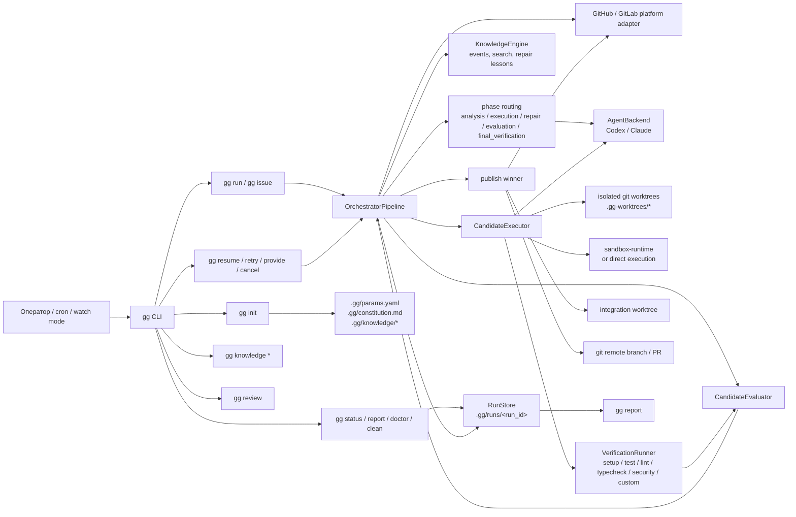
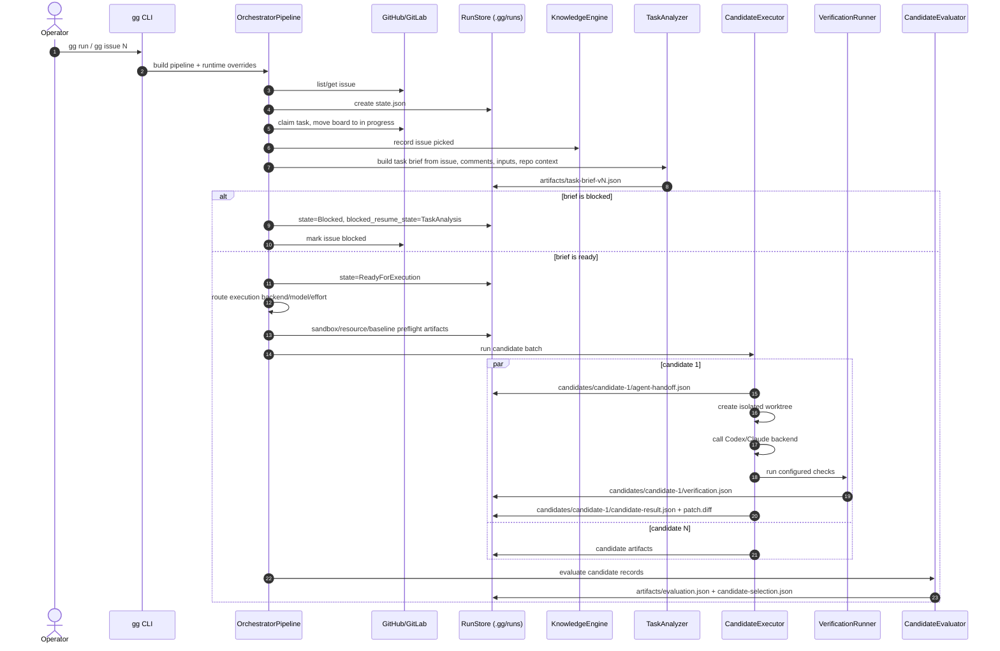
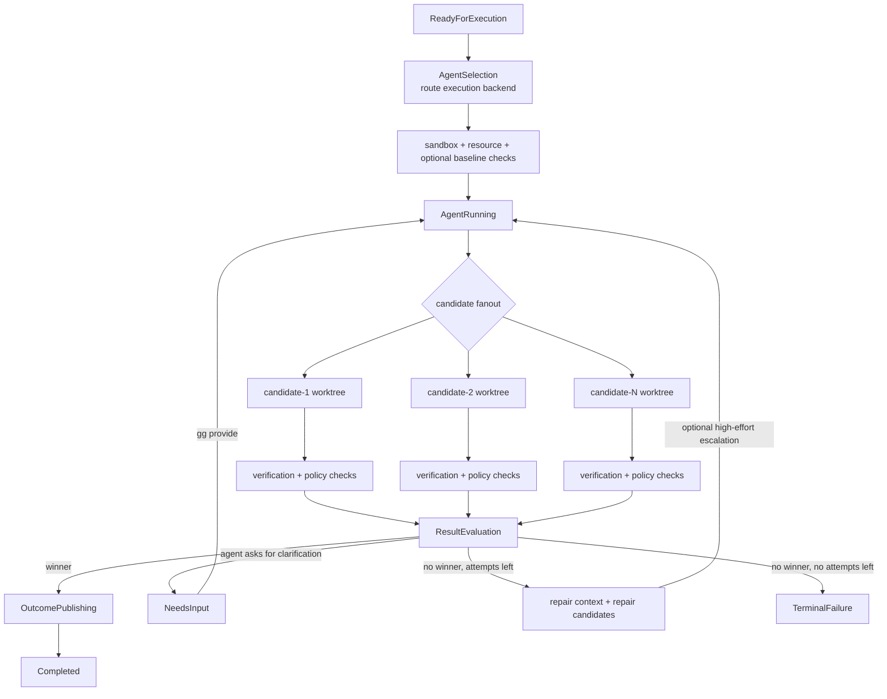
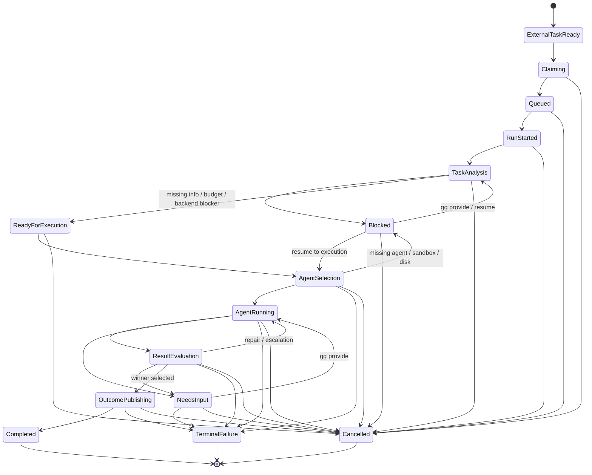
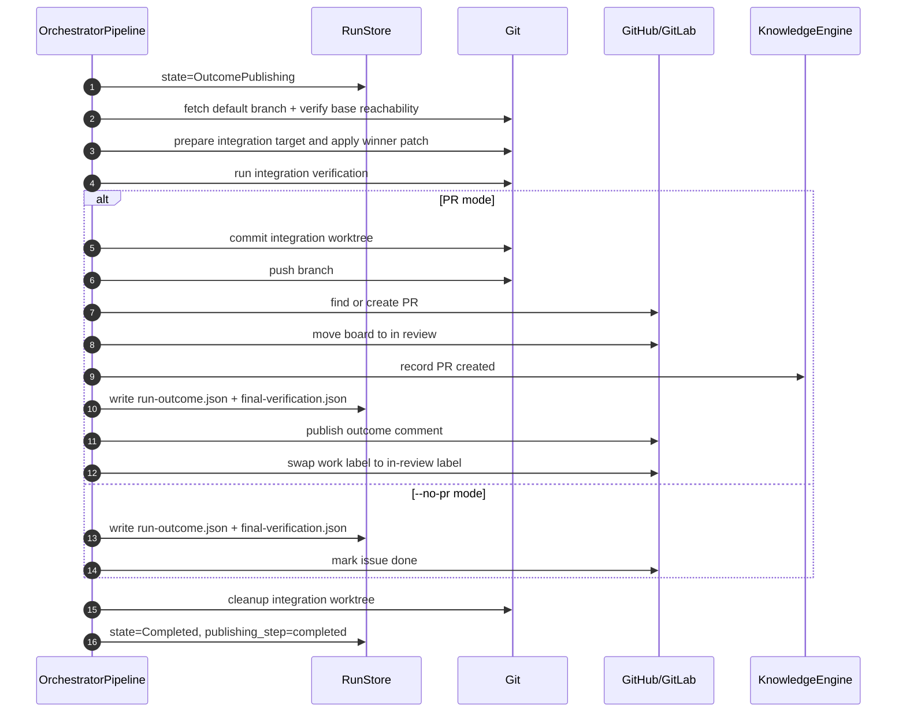
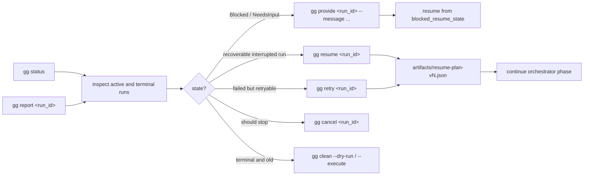

# GG Diagram Design

Этот документ показывает, как `gg` работает как система: от выбора задачи в трекере до публикации PR, восстановления и отчета по сохраненным артефактам.

## Карта Системы

## Основной Запуск

## Candidate Fanout And Repair Loop

Правило отбора простое: кандидат должен не только успешно отработать агентом, но и пройти verification gate. Если проверка меняет worktree, ломаются обязательные команды или нарушается policy, кандидат считается failed даже при `status=success` от агента.

## State Machine

## Publish Flow

`OutcomePublishing` intentionally stores `publishing_step`. If the process dies after commit, push, PR creation, or comment publication, `gg resume <run_id>` can continue from the last durable side-effect boundary instead of repeating the whole run.

## Durable Artifacts

```mermaid
flowchart TB
    RunDir[".gg/runs/&lt;run_id&gt;/"] --> State["state.json<br/>current state, attempts, candidates, PR URL"]
    RunDir --> Events["pipeline.jsonl<br/>state transitions, artifact updates, publish steps"]
    RunDir --> Errors["errors.jsonl"]
    RunDir --> Cost["cost.jsonl"]
    RunDir --> Artifacts["artifacts/"]
    RunDir --> Candidates["candidates/&lt;candidate_id&gt;/"]

    Artifacts --> Brief["task-brief-vN.json"]
    Artifacts --> RawIssue["raw-issue-vN.json"]
    Artifacts --> Context["context-snapshot-vN.json"]
    Artifacts --> Preflight["sandbox/resource preflight"]
    Artifacts --> Selection["candidate-selection.json"]
    Artifacts --> Evaluation["evaluation.json"]
    Artifacts --> Final["final-verification.json"]
    Artifacts --> Outcome["run-outcome.json"]
    Artifacts --> Resume["resume-plan-vN.json"]

    Candidates --> Handoff["agent-handoff.json"]
    Candidates --> AgentResult["agent-result.json"]
    Candidates --> CandidateResult["candidate-result.json"]
    Candidates --> Patch["patch.diff"]
    Candidates --> Verification["verification.json"]

    State --> Report["gg report"]
    Events --> Report
    Evaluation --> Report
    Final --> Report
    Cost --> Report
```

## Recovery And Operator Commands

## Design Invariants

- `state.json` is the source of truth for the current run state.
- All non-trivial decisions write durable artifacts before the next side effect.
- Candidate work happens in isolated worktrees; publish happens through a separate integration target.
- Verification is part of candidate validity, not a postscript.
- Resume is orchestrator-level recovery: it reuses durable artifacts and reruns interrupted candidate work when needed; it does not promise continuation of a live LLM session.
- PR-backed runs move work to review, while `--no-pr` runs can mark the external task done directly.
- Report/status commands are read-only projections over durable state and artifacts.

## Code Map

- `src/gg/cli.py`: command surface and runtime flag wiring.
- `src/gg/orchestrator/pipeline.py`: main state machine, issue claiming, execution, evaluation, publishing, resume/retry/provide/cancel.
- `src/gg/orchestrator/executor.py`: candidate worktree execution, agent handoff/result models, sandbox preflight.
- `src/gg/orchestrator/verification.py`: configured command execution and verification gate summary.
- `src/gg/orchestrator/evaluation.py`: candidate scoring and winner/repair/input decision.
- `src/gg/orchestrator/store.py`: durable run store, artifact writing, event logging, cost aggregation.
- `src/gg/orchestrator/report.py`: read-only report builder from durable artifacts.
- `src/gg/orchestrator/state.py`: allowed task states and transitions.
- `src/gg/orchestrator/config.py`: `.gg/params.yaml` schema and phase routing.
- `src/gg/knowledge/*`: issue history, repair lessons, search, and context generation.
